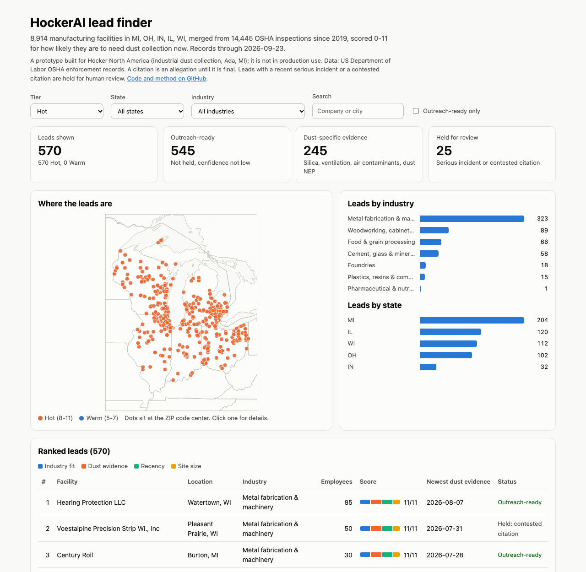
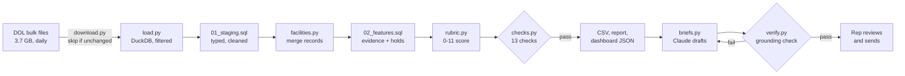

# HockerAI: dust-collection sales leads from OSHA records

A Python and SQL pipeline that turns the US Department of Labor's public OSHA inspection data into a ranked list of manufacturers that are likely to need industrial dust collection now, with an optional Claude step that drafts a lead brief and an email for a sales rep, checks the draft against the records, and never sends anything.

Built as a prototype for Hocker North America, a dust-collection company in Ada, Michigan. It isn't in production use.

**[Live dashboard](https://dipzinski.github.io/HockerAI/)** · [Lead report](outputs/report.md) · [Lead list (CSV)](outputs/leads.csv)



## The problem

Sales teams for industrial equipment aren't short of prospects: every plant that sands, grinds, cuts, or mixes powder is one. Their bottleneck is research time per lead: finding which plants have a reason to buy *now*, and what to say to them. OSHA publishes every inspection and citation, and a plant that was just cited for silica, poor ventilation, or combustible dust has a deadline to fix it. This project finds those plants and explains why each one is worth a call.

## Results (records through 2026-09-23)

| | |
|---|---|
| OSHA inspections scanned | 5,202,096 nationwide |
| Kept: target industries in MI, OH, IN, IL, WI since 2019 | 14,445 inspections, 36,472 citations |
| Facilities after merging duplicate records | 8,914 (845 had 2+ spellings of their name) |
| **Hot leads (8-11 of 11)** | **570**: 545 ready for outreach, 25 held for human review |
| Hot leads with dust-specific citations | 245 (silica, ventilation, air contaminants, metal dust, grain dust) |
| Warm leads (5-7) | 1,661 |
| Data-quality checks | 13 of 13 pass on every build |
| Unit tests | 37 pass |

Hot leads by industry: metal fabrication and machinery 323, woodworking and furniture 89, food and grain 66, cement and minerals 58, foundries 18, plastics 15, pharma 1. By state: MI 204, IL 120, WI 112, OH 102, IN 32. The full breakdown is in [outputs/report.md](outputs/report.md).

## How it works



1. **Download** (`hocker/download.py`): the five OSHA tables (inspections, citations, emphasis programs, accidents, injuries) from the Department of Labor, plus Census ZIP centroids for the map. A rerun skips files whose `Last-Modified` hasn't changed.
2. **Load** (`hocker/load.py`): unzips 440 CSV chunks and reads them with DuckDB in one pass, keeping only target-industry inspections in the five states since 2019. The 3.7 GB download becomes a small database; the whole build takes about 15 seconds.
3. **Stage** (`sql/01_staging.sql`): explicit types, withdrawn citations dropped, public agencies dropped, and impossible headcounts cleared (see Data quality).
4. **Merge facilities** (`hocker/facilities.py`): OSHA has no facility ID, so "SAUDER WOODWORKING CO" and "Sauder Woodworking Company" look like two plants. Records are merged when they share a ZIP code and either a normalized name, or a normalized street address plus a similar name (so two tenants of one building stay separate). Groups are built with union-find.
5. **Classify citations** (`hocker/standards.py`): 2,488 distinct citation codes are parsed into readable form (`19100094 A01 I` → `29 CFR 1910.94(a)(1)(i)`) and sorted into dust-specific, dust-related, or other. Michigan runs its own OSHA program and cites Michigan rules (`R 325.52001`, Part 520 Ventilation Control), which are mapped with the same categories from the MIOSHA part index.
6. **Score** (`sql/02_features.sql`, `hocker/rubric.py`): see below.
7. **Check and export** (`hocker/checks.py`, `hocker/export.py`): the build stops if any check fails; otherwise it writes the CSV, the report, a list of new Hot leads since the last run, and the dashboard data.

## How leads are scored

The 0-11 rubric comes from v1 (below), now computed from records instead of judged by a model:

| Criterion | Points | From the OSHA records |
|---|---|---|
| Industry fit | 0-3 | NAICS code, in the sales team's priority order: woodworking and metal fabrication 3; cement/minerals and food 2; pharma, plastics, foundries 1 |
| Dust evidence | 0-3 | 3: a dust-specific citation (silica, ventilation, air-contaminant limits, lead/chromium/cadmium/beryllium, grain handling, or a general-duty or hazard-communication citation in a Combustible Dust inspection). 2: a dust-related citation (housekeeping, respirators, spray booths, welding ventilation) or an inspection under a dust emphasis program. 1: any other serious citation |
| Recency | 0-3 | Newest dust evidence within 12, 24, or 36 months. A fresh citation comes with an abatement deadline, which is when a plant buys equipment. Unrelated citations earn no recency points, so a plant can't reach Hot without dust evidence |
| Site size | 0-2 | Employees at the inspected site (not company-wide): 20-500 earns 2, 10-19 or 501-1,000 earns 1 |

**Hot** is 8-11, **Warm** 5-7, **Archive** 0-4. A facility with no citation or dust-program inspection in the last 36 months is Archive regardless of fit, since nothing says to call now.

**Holds override the score** (v1's "Archive overrides score" rule): a fatality in the last 36 months, a serious-injury inspection in the last 24 months, or a citation under contest blocks outreach until a person reviews the lead. **Confidence** is High when the site headcount is known and the industry code is consistent across inspections; a lead with Low confidence isn't outreach-ready.

## AI lead briefs (Claude API)

`python -m hocker briefs` writes a brief for each of the top 25 outreach-ready Hot leads:

- **Input:** only that facility's records as JSON: the dust-related citations in full and a count of unrelated ones. No web search, no personal names, and no injury details.
- **Output:** a fixed JSON schema enforced with structured outputs: `why_now`, `talking_points` (each citing the inspection IDs it came from), `suggested_contact_role`, `email_subject`, `email_body`.
- **Verification** (`hocker/verify.py`), in code rather than in the prompt: every inspection ID must exist in that facility's records; every number in the draft (penalties, dates, headcounts, standards) must appear in the records, so a computed total or a rounded figure fails; stated counts of citations or inspections must be correct; banned topics (injuries, lawsuits, compliance guarantees, prices) and dollar amounts in the email fail.
- **Retry:** a failing draft goes back to Claude once with the checker's list of problems; if it still fails, it's marked "needs human edit". Results, token use, and cost go to `outputs/briefs/summary.json`.
- **Tests:** `tests/test_verify.py` feeds the checker drafts with seeded errors (an invented penalty, a wrong inspection ID, a computed total, a wrong count, banned topics), and `tests/test_briefs.py` runs the retry loop against a fake client, so the logic is tested without API calls.

Model: `claude-opus-5-5` with structured JSON output; 25 briefs are estimated to cost $1-3.

## Data quality

Problems found in the source data and how the pipeline handles them:

- **Company-wide headcounts entered as site headcounts:** e.g. 150,000 employees at one meat plant. 24 values of 5,000 or more are cleared, which lowers that lead's confidence instead of inflating its size.
- **Duplicate facilities:** 9,913 raw name/ZIP combinations collapse to 8,914 facilities; tests cover renamed companies at the same address and unrelated tenants of one building.
- **Withdrawn citations:** rows with `DELETE_FLAG = 'X'` are dropped, and a check confirms none survive.
- **Two citation systems:** federal codes and Michigan's MIOSHA rules are both classified; Michigan rule numbers are mapped by range because some prefixes are shared by unrelated parts (e.g. R 325.511xx covers both air contaminants and labor camps).
- **Mixed CSV quoting:** some chunks were auto-detected with no quote character, which broke on citation text with commas; quoting is set explicitly, and rejected rows are counted (0).
- **Lagging accident data:** the accident tables have almost no records after 2022, so holds also use the inspection type (fatality/catastrophe and accident inspections), which is current.

The 13 checks (`hocker/checks.py`) cover unique IDs, one facility per inspection, citations linked to inspections, no withdrawn citations, every standard classified, territory and industry filters, date window, headcount range, one score per facility, score arithmetic, tier cutoffs, holds never outreach-eligible, and every Hot lead backed by dust evidence.

## Run it

```bash
python3 -m venv .venv && source .venv/bin/activate
pip install -r requirements.txt
python -m hocker all            # download (~3.7 GB, skips unchanged files) + build (~15 s)
pytest                          # 37 tests
open docs/index.html            # or serve docs/ and open it in a browser
```

AI briefs (optional; needs an Anthropic API key):

```bash
export ANTHROPIC_API_KEY=...    # from console.anthropic.com
python -m hocker briefs         # top 25 outreach-ready Hot leads
python -m hocker briefs --dry-run   # writes the exact prompt inputs, no API calls
```

Rerunning `python -m hocker all` after the Department of Labor updates its files writes `outputs/new_hot_leads.md`, the Hot leads that are new since the previous run.

## Project layout

```
hocker/           Python package: download, load, facilities, standards, rubric, checks, export, briefs, verify
sql/              DuckDB SQL: staging and features
tests/            pytest: parsing, merging, scoring, verifier, retry loop
docs/             GitHub Pages dashboard (index.html + data/leads.json)
outputs/          leads.csv, report.md, run_log.json, briefs/
v1-prompt-prototype/   the July 2026 prototype (see below)
```

## Limitations

- OSHA inspects a small share of plants, so no citations doesn't mean no dust problem. The list finds plants with a documented, recent reason to buy; it can't see the rest.
- A citation is an allegation until it's final, and the dashboard says so.
- Industry weights follow the sales team's v1 priority list and haven't been validated against real sales outcomes, since the tool hasn't been used by a sales team.
- Map points sit at the ZIP code's center, not the street address.
- NAICS codes are entered by inspectors and are sometimes wrong; facilities whose code changes between inspections get lower confidence.

## v1 → v2

**v1 (July 2026)** was four Claude Code subagents defined in Markdown (lead generation, daily scan, enrichment and scoring, outreach drafting) with a shared scoring rubric and guardrails. It had no code: the model searched the web, scored leads, and wrote the CSV itself. A smoke test on 5 Ohio woodworking companies worked, but the scores couldn't be reproduced, the "daily scan" never ran, and the no-fabrication rules existed only as instructions to the model. v1 is kept in [`v1-prompt-prototype/`](v1-prompt-prototype/).

**v2 (September 2026)** keeps v1's idea, rubric, and guardrails and moves everything that can be deterministic into tested code: a public data source instead of open web search, SQL features, a rule-based score, automated checks, and a verifier that enforces the no-fabrication rules on the model's output. The model now does only what it's good at, writing the brief and email, and a person still approves every message.
